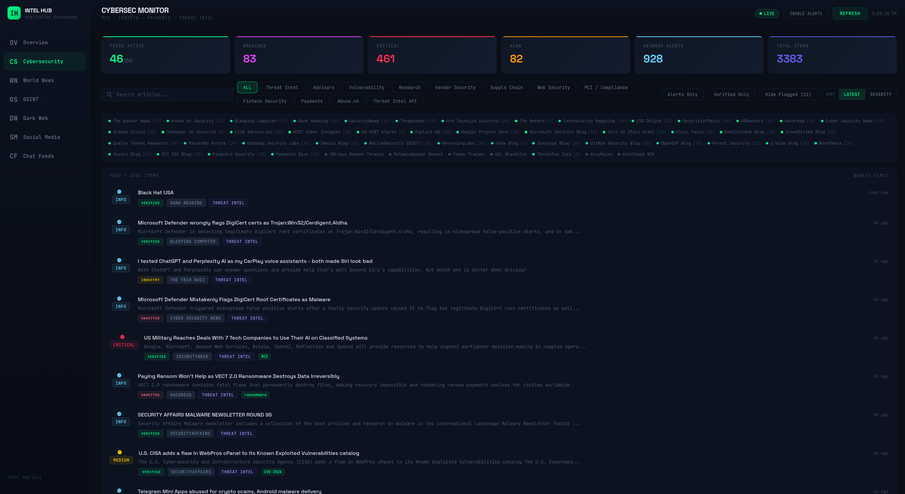

# Intel Hub

> Real-time cybersecurity, geopolitics, OSINT, dark web, social media, and chat-feed intelligence — 7 channels, 170+ feeds, severity classification, source credibility, political bias tagging, Telegram monitoring, and webhook ingest. One process, one port, zero required API keys.



## Features

- **7-channel dashboard** — Cybersecurity · World News · Geopolitics & Defense · OSINT · Dark Web · Social Media · Chat Feeds
- **170+ feeds** with auto-severity, deduplication, and 90-day retention
- **Curated Telegram monitoring** — every channel verified active in the last 7 days; auto-rotation when channels go dark
- **Universal Ingest API** — push messages from Tasker, iOS Shortcuts, Discord bots, signal-cli, anything
- **Source credibility scoring** (4-tier) and **political bias tagging** (7 categories)
- **Promotional content filter** — drops syndicated affiliate spam (credit-card, home-equity, "0% APR" posts)
- **Real-time updates** via WebSocket on the same origin as the served frontend
- **Email alerts** for high-severity items
- **Memory-bounded** with tiered compaction → eviction; safe to leave running indefinitely
- **Single-process production** — bundles the React frontend and serves it from the Node server; auto-launches the browser

## Quick Start

Three ways to run Intel Hub. All end at `http://localhost:3001`.

### Option A — Prebuilt Docker image (fastest)

No clone, no build. Pulls the published image from GitHub Container Registry:

```bash
docker run -d --name intel-hub \
  -p 3001:3001 \
  -v intel_hub_data:/app/data \
  --restart unless-stopped \
  ghcr.io/juancarlosmunera/intel-hub:latest
```

To upgrade: `docker pull ghcr.io/juancarlosmunera/intel-hub:latest` then recreate the container.

### Option B — Docker Compose (build from source)

```bash
git clone https://github.com/juancarlosmunera/intel-hub.git
cd intel-hub
cp .env.example .env    # optional
docker compose up -d
```

```bash
docker compose logs -f intel-hub   # tail logs
docker compose restart intel-hub   # restart
docker compose down                # stop (data preserved)
docker compose down -v             # stop AND wipe scraped data
```

Articles persist in a named Docker volume across restarts. To upgrade: `git pull && docker compose up -d --build`.

### Option C — Native Node.js + PM2

Requires **Node.js 18+**.

```bash
git clone https://github.com/juancarlosmunera/intel-hub.git
cd intel-hub
cp .env.example .env    # optional
npm install
npm start               # builds, starts PM2, opens browser
```

Other commands: `npm run logs`, `npm run status`, `npm run stop`, `npm run restart`.

### Development (hot reload)

```bash
npm run dev             # backend on 3001, Vite on 3000 (auto-opens browser)
```

### Windows

Docker Desktop (Options A and B) is the smoothest path on Windows — it works identically to Mac and Linux.

For the native Node path, **WSL2** is recommended over native Windows so the Linux-tested process management and scripts behave the same:

```powershell
wsl --install -d Ubuntu          # PowerShell as Admin, one-time
```

Then inside Ubuntu, install Node 20 (via [nvm](https://github.com/nvm-sh/nvm)) and follow Option C. To run on boot, add `cd ~/intel-hub && npx pm2 resurrect` to `~/.bashrc` and run `npx pm2 save` once.

Native Windows Node works too, but PM2 boot-autostart needs `pm2-windows-startup` (`npm i -g pm2-windows-startup && pm2-startup install`), and PM2 cluster mode should stay at `instances: 1` (already the default).

## Channels at a glance

| Channel | Feeds | Notes |
|---------|-------|-------|
| Cybersecurity | 45+ | News, threat research, advisories, supply chain, PCI/compliance, live IoC APIs |
| World News | 40+ | Wire services, US/international, US politics, think tanks, independent journalism |
| Geopolitics & Defense | 20 | Foreign policy outlets, defense publications, conflict monitors |
| OSINT | 24+ | GDELT, Bellingcat, vendor threat intel, government advisories, sanctions |
| Dark Web | 20+ | Ransomware tracking, breach journalism, malware analysis, Ransomfeed.it API |
| Social Media | 16+ | Reddit, Mastodon, GitHub Advisories, NVD, optional X/Twitter |
| Chat Feeds | 11+2 | Curated Telegram channels with `npm run tg:audit` freshness check |

Full per-channel source lists in [`docs/sources.md`](docs/sources.md).

## Documentation

| Topic | Doc |
|-------|-----|
| Full source lists per channel | [docs/sources.md](docs/sources.md) |
| Architecture & data flow | [docs/architecture.md](docs/architecture.md) |
| API integrations & env vars | [docs/api.md](docs/api.md) |
| Universal Ingest API (webhook) | [docs/ingest-api.md](docs/ingest-api.md) |
| Telegram setup & freshness audit | [docs/telegram-setup.md](docs/telegram-setup.md) |
| Source credibility tiers | [docs/credibility.md](docs/credibility.md) |
| Political bias tagging | [docs/bias.md](docs/bias.md) |
| Memory management | [docs/memory.md](docs/memory.md) |
| Customization (add feeds, keywords, etc.) | [docs/customization.md](docs/customization.md) |
| How to contribute | [CONTRIBUTING.md](CONTRIBUTING.md) |

## License

MIT — see [LICENSE](LICENSE).
