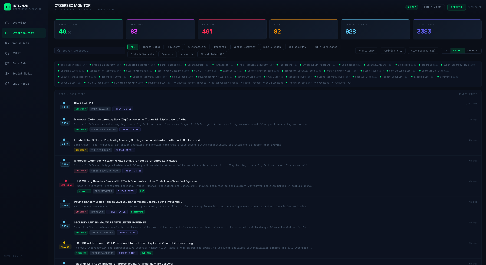

## Intel Hub

> Real-time cybersecurity, geopolitics, OSINT, dark web, social media, and chat-feed intelligence — 7 channels, 170+ feeds, severity classification, source credibility, political bias tagging, Telegram monitoring, and webhook ingest. One process, one port, zero required API keys.

## Features

- **7-channel dashboard** — Cybersecurity · World News · Geopolitics & Defense · OSINT · Dark Web · Social Media · Chat Feeds
- **170+ feeds** with auto-severity, deduplication, and 90-day retention
- **Curated Telegram monitoring** — every channel verified active in the last 7 days; auto-rotation when channels go dark
- **Universal Ingest API** — push messages from Tasker, iOS Shortcuts, Discord bots, signal-cli, anything
- **Source credibility scoring** (4-tier) and **political bias tagging** (7 categories)
- **Promotional content filter** — drops syndicated affiliate spam (credit-card, home-equity, "0% APR" posts)
- **Real-time updates** via WebSocket on the same origin as the served frontend
- **Email alerts** for high-severity items
- **Memory-bounded** with tiered compaction → eviction; safe to leave running indefinitely
- **Single-process production** — bundles the React frontend and serves it from the Node server; auto-launches the browser

## Quick Start

Three ways to run Intel Hub. All end at `http://localhost:3001`.

### Option A — Prebuilt Docker image (fastest)

No clone, no build. Pulls the published image from GitHub Container Registry:
